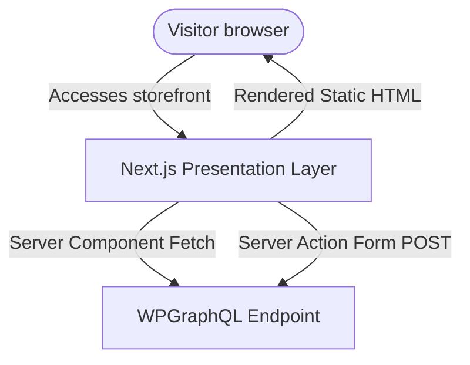
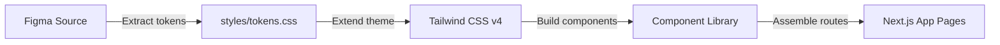

## 1. Frontend Architecture & Layers

The Layale frontend is decoupled from the editorial backend. Visitors access the Next.js presentation server, which queries the WordPress endpoint over GraphQL.



### The Presentation Layer (Three Sub-Layers)
1. **Server Components (RSC)**: Used for layout grids ([layout.tsx](file:///D:/layalee-next/layale_headless/app/layout.tsx)) and page shells ([page.tsx](file:///D:/layalee-next/layale_headless/app/page.tsx)). Server components fetch GraphQL endpoints during compilation or revalidation, rendering clean static HTML for speed and SEO.
2. **Client Components (React Islands)**: Used solely for interactive segments (e.g., [ContactForm.tsx](file:///D:/layalee-next/layale_headless/feature/contact/ContactForm.tsx), variant swatches in [ProductSection.tsx](file:///D:/layalee-next/layale_headless/feature/product_detail/ProductSection.tsx)). Kept lean to minimize JavaScript bundles.
3. **Next.js Server Actions**: Used as a secure intermediary layer. Form submissions from the browser are posted to Server Actions, which validate the schema, shield API credentials, and forward the mutation to the database.

---

## 2. Decided Frontend Tech Stack

We use standard, free open-source tools to build the presentation layer:

* **Next.js 16 (App Router)**: The underlying framework. Next.js App Router is our absolute default. Turbopack is utilized as the development bundler.
* **React 19.2**: Powered by the React Compiler to automatically optimize component re-renders.
* **Tailwind CSS v4 & @tailwindcss/postcss**: Used to implement a clean utility design system based on Figma tokens without writing ad-hoc CSS.
* **TypeScript**: Enforces typing constraints across custom fetch routines, design properties, and layout templates.
* **Native Fetch API**: Used for data retrieval within Server Components.
* **Zod**: Used to validate form submissions and schema structures at the boundary layer before forwarding data to the backend.

---

## 3. Project / Repository Structure

The frontend repository separates route management, feature-based components, and utility layers:

```text
frontend/
├── app/                      # Next.js App Router Pages
│   ├── (marketing)/          # Route Group for standard marketing pages
│   │   ├── page.tsx          # Homepage view (queries layout blocks)
│   │   └── contact/
│   │       └── page.tsx      # Contact Page (renders banner, forms, and cards)
│   ├── product/
│   │   ├── [categorySlug]/
│   │   │   ├── page.tsx      # Product catalog list matching the dynamic category
│   │   │   └── [productSlug]/
│   │   │       └── page.tsx  # Product Detail Page (variants, galleries, specifications)
│   │   └── page.tsx          # Fallback / general products listing route
│   ├── api/
│   │   └── revalidate/
│   │       └── route.ts      # Webhook route handler for on-demand static page revalidation
│   ├── layout.tsx            # Global HTML layout (loads Header and Footer)
│   ├── error.tsx             # Standard network/connection fallback page
│   └── global-error.tsx      # Critical layout-level error recovery screen
├── components/               # Global Design System Layouts
│   ├── Header.tsx            # Navigation bar (maps dynamic menus and announcement strips)
│   └── Footer.tsx            # Footers, newsletters, and social links
├── feature/                  # Page-Specific Feature Modules
│   ├── home/                 # Homepage sections (Banner, Category, GetInspired, etc.)
│   ├── contact/              # Contact forms and maps
│   ├── product/              # Catalog display layout modules
│   └── product_detail/       # Detail galleries and accordion sections
├── lib/                      # Configuration and Data Layers
│   └── wordpress.tsx         # Central GraphQL queries and API fetching routines
├── public/                   # Static local assets (logos, fallbacks, local illustrations)
├── .env                      # Environment config keys (WP URL, Contact Form ID)
└── next.config.ts            # Image host rules and webpack controls
```

---

## 4. Content Modeling & Data Sources

The frontend fetches data via a centralized fetch helper in [wordpress.tsx](file:///D:/layalee-next/layale_headless/lib/wordpress.tsx). The table below details page routes, data sources, and corresponding GraphQL queries:

| Page Route | Content Source | GraphQL Query Root |
| :--- | :--- | :--- |
| **Homepage** | Layout settings, banner, category sliders, and featured items. | `GetHeaderAndHomePageData` query, mapping layout, theme options, and category nodes. |
| **Contact Page** | Footer contact details, address settings, and phone metadata. | Queried in layout, mapped to details cards. Submissions execute a `submitContactForm` GraphQL mutation. |
| **Product Catalog** | Product lists, color swatches, filter taxonomy nodes. | `GetProductsByCategory($categorySlug)` query, filtering list elements dynamically. |
| **Product Detail** | Gallery images, sizes, description blocks, care accordions. | `GetProductDetailBySlug($slug)` query, returning color lists, sizes, and specs tables. |

---

## 5. Page-by-Page Build Specification

We use hybrid rendering strategies to optimize Core Web Vitals (LCP, CLS, INP) across different routes:

### 1. Homepage
* **Rendering Strategy**: Incremental Static Regeneration (ISR) with a 60-second revalidation limit.
* **Key Tasks**: 
  * Optimize Largest Contentful Paint (LCP) by using `next/image` with `priority` tags for the hero banner.
  * Map navigation links dynamically and sanitize announcement SVGs.

### 2. Product Catalog (`/product/[categorySlug]`)
* **Rendering Strategy**: ISR with dynamic paths resolved at compile-time.
* **Key Tasks**:
  * Implement [ProductCatalog](file:///D:/layalee-next/layale_headless/app/product/page.tsx) rendering dynamic product grids.
  * Mount a client-side filter drawer allowing visitors to filter by material, color, and size values.

### 3. Product Detail (`/product/[categorySlug]/[productSlug]`)
* **Rendering Strategy**: ISR + `generateStaticParams()` to pre-compile all product pages.
* **Key Tasks**:
  * Capture variant changes (e.g. active color index) in client state.
  * Keep product path static for SEO; map selected variables to URL query params (e.g., `?colour=beige&size=18`) for easy shareability, setting the canonical URL to the base product path.

### 4. Contact Page (`/contact`)
* **Rendering Strategy**: Static Page containing an interactive Form client island.
* **Key Tasks**:
  * Align inputs, placeholders, labels, and font families directly with the brand style guidelines.
  * Embed an interactive Google Maps iframe block rather than flat images.
  * Bind form submissions to a Next.js Server Action utilizing Zod verification.

---

## 6. SEO & Migration Standards

In a headless frontend, SEO is entirely owned by the Next.js storefront. We implement the following patterns to secure indexing and search rankings:

### Dynamic Page Metadata
Every dynamic route exports a `generateMetadata` function that queries the SEO node attributes:

```typescript
export async function generateMetadata({ params }): Promise<Metadata> {
  const { product } = await getProductDetailBySlug(params.productSlug);
  return {
    title: `${product.title} | Layale`,
    description: product.seo?.metaDesc || product.description,
    alternates: {
      canonical: `https://layale.com/product/${params.categorySlug}/${params.productSlug}`,
    },
    openGraph: {
      title: product.seo?.title || product.title,
      images: [{ url: product.seo?.image || '/fallback.png' }],
    },
  };
}
```

### Structured Data (JSON-LD)
Inject structured schema tags dynamically on the client using `<script type="application/ld+json">`:
* **Organization / WebSite**: General layout metadata.
* **BreadcrumbList**: Maps hierarchical trails: `Home > Indoor Planters > Cilin Tall`.
* **Product Schema**: Injected on the product detail page, mapping name, images, description, and material attributes.

### Sitemaps & robots.txt
* **Sitemaps (`app/sitemap.ts`)**: Programmatically queries all category and product slugs, emitting the public domain URLs (`https://layale.com/product/...`) instead of backend WordPress URLs.
* **Robots.txt (`app/robots.ts`)**: Directs search engine crawlers to parse the Next.js sitemap while blocking indexing of backend database paths.

---

## 7. Design-to-Development Workflow

To prevent design divergence and minimize custom styling layers, we follow a strict component-driven development process:



### Steps for UI Alignment
1. **Design Tokens Extraction**: Pull color hex codes, spacing scales, typography weights, and border-radius specifications from Figma. Define them as CSS custom variables in `globals.css` and wire them into Tailwind.
2. **Component Library Isolation**: Build reusable layout elements (buttons, selectors, modal blocks, information cards, product cards) as independent, styled React elements. Ensure WCAG color contrast guidelines are met.
3. **Asset Optimization**: Export icons and illustrations from Figma as SVGs, clean them with SVGO, and embed them directly to minimize network requests.

---

## 8. Frontend Security & Hardening Checklist

Because the frontend acts as the public gate to the project, we implement strict security policies:

* **Input Sanitization**: Always sanitize and parse WordPress HTML nodes before rendering to avoid Cross-Site Scripting (XSS).
* **Environment Shielding**: Secrets (like WPGraphQL tokens or databases configuration paths) must remain on the server. Only variables prefixed with `NEXT_PUBLIC_` are exposed to the client bundle.
* **Security Headers**: Standardize security headers (CSP, HSTS, X-Content-Type-Options) in deployment pipelines.
* **Server Action Protection**: Rate-limit API route handlers and validate form payloads via Zod before sending mutations.

---

## 9. Code Review Standards

Every pull request must pass the following quality checks:
* **No `any` Types**: GraphQL response types must map to strict TypeScript interfaces.
* **No Inline Magic Numbers**: Margin, padding, and color values must use Tailwind token classes rather than absolute pixel or hex codes.
* **Image Optimization**: All images must render through Next.js `<Image />` tags with specified heights/widths and quality parameters.
* **Error Boundaries**: Components fetching asynchronous data must be wrapped in error boundaries and display custom error messages or retry states.
