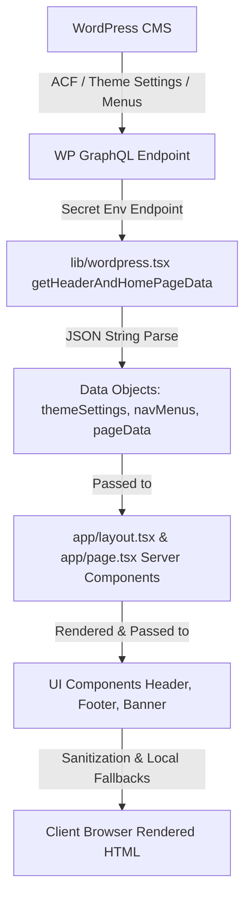

# Layale Project Documentation

Welcome to the headless Next.js project for Layale. Below is an explanation of the folder structure, how the backend API is called, and how the data is processed across the application.

---

## 1. Project Folder Structure

The project follows a standard Next.js App Router structure combined with modular folders for layouts, utilities, and features:

```text
layale_headless/
├── app/                  # Next.js App Router Pages & Routings
│   ├── layout.tsx        # Root HTML shell, runs server-side API for Header/Footer
│   ├── page.tsx          # Homepage view, runs server-side API for content blocks
│   └── product/          # Product details page routes (future phases)
├── components/           # Global design system UI layouts
│   ├── Header.tsx        # Responsive navigation bar (uses themeSettings & navMenus)
│   └── Footer.tsx        # Multi-column footer and newsletter (uses themeSettings & navMenus)
├── feature/              # Feature-specific components grouped by module
│   ├── home/             # Homepage module sections
│   │   ├── Banner.tsx            # Main hero slider/carousel
│   │   ├── Category.tsx          # Collection categories
│   │   ├── Expert-Assistance.tsx # Banner section for customer help
│   │   ├── Featured.tsx          # Featured product grids
│   │   ├── Get-inspired.tsx      # Inspirational slider block
│   │   ├── Promise.tsx           # Company promise section
│   │   └── nature-inspired.tsx   # Botanical theme section
│   └── ProductSection.tsx        # Feature components for product displays
├── lib/                  # Utilities, configuration, and API layers
│   └── wordpress.tsx     # GraphQL queries & fetching wrapper for WordPress
├── public/               # Static assets (images, icons, default logo)
├── .env                  # Configuration variables (WordPress URL/secret)
└── package.json          # Dependency configurations
```

---

## 2. Where the API is Called

The API calling logic is centralized under [wordpress.tsx](file:///D:/layalee-next/layale_headless/lib/wordpress.tsx). The functions query a headless WordPress instance using GraphQL. 

To achieve optimal performance and minimize network roundtrips, the application relies on the following flow:

### Step 1: Centralized GraphQL Fetching
* **File:** [wordpress.tsx](file:///D:/layalee-next/layale_headless/lib/wordpress.tsx)
* **Function:** [getHeaderAndHomePageData](file:///D:/layalee-next/layale_headless/lib/wordpress.tsx#L47-L161)
* **Mechanism:** 
  * It retrieves the CMS endpoint URL from `process.env.Secret`.
  * It constructs a single large GraphQL query (`GetHeaderAndHomePageData`) which bundles requests for:
    1. **Theme Settings** (`layaleThemeSettings`) – header strips, footer copy, brand styles, social links, address details.
    2. **Navigation Menus** (`layaleNavMenus`) – links grouped into headers, footers, shop categories, company info, and legal links.
    3. **Homepage Blocks** (`homepage: page(...)`) – homepage-specific sliders, text content, options.
    4. **Product Categories** (`productCategories`) – categories list.
    5. **Products** (`products`) – basic information for the initial products list.

### Step 2: Root Layout Server-Side Load (Header/Footer)
* **File:** [layout.tsx](file:///D:/layalee-next/layale_headless/app/layout.tsx)
* **Mechanism:**
  * When a visitor accesses any route on the site, Next.js calls [getHeaderAndHomePageData](file:///D:/layalee-next/layale_headless/lib/wordpress.tsx#L47-L161) on the server side.
  * The returned `themeSettings` and `navMenus` objects are passed directly into the global `<Header>` and `<Footer>` layout components.
  * Because this is executed server-side, the rendered layout is generated as static HTML before being sent to the browser (perfect for SEO and page load speeds).

### Step 3: Homepage Component Server-Side Load
* **File:** [page.tsx](file:///D:/layalee-next/layale_headless/app/page.tsx)
* **Mechanism:**
  * Similar to the layout, the home page's default export function is a Server Component.
  * It calls [getHeaderAndHomePageData](file:///D:/layalee-next/layale_headless/lib/wordpress.tsx#L47-L161) to receive page-specific dynamic data (`homepage`, `productCategories`, `products`).
  * It spreads this data down into the respective feature section components (e.g. `<Banner homepage={homepage} />`, `<Featured products={products} />`, etc.).

---

## 3. How Data is Handled (Step-by-Step Flow)

Here is the exact progression of how data travels from WordPress to the user's screen:



### Step-by-Step Data Flow
1. **CMS Input**: WordPress editors modify settings (e.g., logo, header banner announcements, links) using custom fields.
2. **GraphQL Querying**: Next.js sends a POST request containing the GraphQL schema to the endpoint.
3. **JSON Decoding**: 
   * WordPress returns global theme settings and menus serialized as JSON strings.
   * [wordpress.tsx](file:///D:/layalee-next/layale_headless/lib/wordpress.tsx) parses these JSON strings using `JSON.parse(rawThemeSettings)` and `JSON.parse(rawNavMenus)`.
4. **Hydration & Prop Passing**: Next.js passes the parsed Javascript objects into `<Header themeSettings={themeSettings} navMenus={navMenus} />` and `<Footer themeSettings={themeSettings} navMenus={navMenus} />`.
5. **Decoders & Cleanups**: 
   * Inside components like [Header.tsx](file:///D:/layalee-next/layale_headless/components/Header.tsx) or [Footer.tsx](file:///D:/layalee-next/layale_headless/components/Footer.tsx), utility functions decode HTML entities (e.g., changing `&amp;` to `&`).
   * A mapping function `mapUrl` converts relative WordPress backend links (like `/layale_be/category/indoor`) into frontend-friendly slugs (like `/portrait`).
6. **Defensive Fallbacks**: If any field was left blank by an editor in WordPress, the component checks the key and automatically injects a predefined local fallback (e.g., default SVG logo or pre-set announcement strip text).
7. **Hydrated Delivery**: The final page is served to the client as clean, ready-to-display HTML with no client-side API requests required.

### CHALLENGES

 1.The Json.Stringify is a costly process need to switch that to backend 
 2.Remove the fall backs and add a error state to handle the absence of Api data
 3.Add skelton loaders for Homepage 
 4.Error page for Api error
 5.Components creation for Layale(eg:buttons,input,popup,modal etc...)


GitHub link:https://github.com/Arjun976/layalee-headless.git