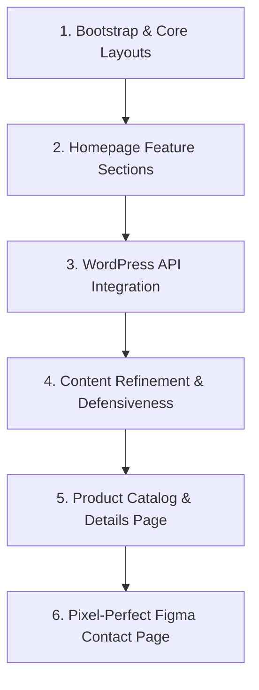
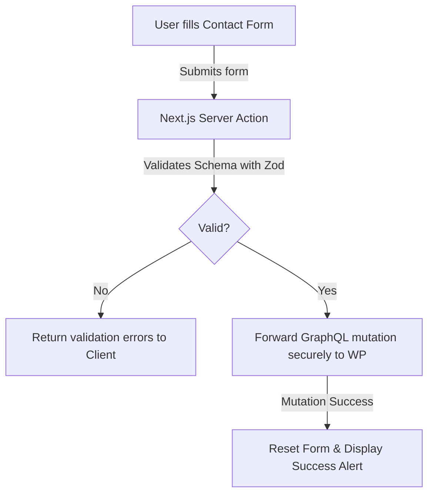

# Layale Headless Next.js Project: Development Journey & GraphQL Plan

This document outlines the architecture, the chronological development steps taken in the project, the plugins used, and the implementation plan using GraphQL for integrating the contact form page with the headless WordPress backend.

---

## 1. Project Overview & Folder Structure

The Layale project is a high-performance, responsive headless storefront built on Next.js 15+ (App Router), TypeScript, and Tailwind CSS. It communicates with a WordPress backend using GraphQL (`WPGraphQL`) to fetch dynamic menus, page options, and theme configurations.

### Directory Structure

```text
layale_headless/
├── app/                  # Next.js App Router Pages & Routings
│   ├── layout.tsx        # Root HTML shell, runs server-side API for Header/Footer
│   ├── page.tsx          # Homepage view, runs server-side API for content blocks
│   ├── contact/          # Contact Page Route
│   │   └── page.tsx      # Renders pixel-perfect layout, banner, contact form and cards
│   ├── product/          # Product Catalog Page Route
│   │   └── page.tsx      # Renders product listings and filtering sidebar
│   └── product_detail/   # Product Detail Page Route
│       └── page.tsx      # Renders individual product view with image gallery
├── components/           # Global design system UI layouts
│   ├── Header.tsx        # Responsive navigation bar (uses themeSettings & navMenus)
│   └── Footer.tsx        # Multi-column footer and newsletter signup (uses themeSettings & navMenus)
├── feature/              # Feature-specific components grouped by module
│   ├── contact/          # Contact module components (Form, Map, Cards)
│   │   ├── ContactCards.tsx
│   │   └── ContactForm.tsx
│   ├── home/             # Homepage module sections
│   │   ├── Banner.tsx            # Main hero slider/carousel
│   │   ├── Category.tsx          # Collection categories
│   │   ├── Expert-Assistance.tsx # Customer consulting/assistance cards
│   │   ├── Get-inspired.tsx      # Slider showcasing inspirational themes
│   │   ├── Promise.tsx           # Company promise / values
│   │   └── nature-inspired.tsx   # Botanical/Nature theme module
│   ├── product/          # Product Catalog feature modules
│   └── product_detail/   # Product Detail feature components
│       └── ProductSection.tsx    # Interactive product page with image gallery and color variants
├── lib/                  # Utilities, configuration, and API layers
│   └── wordpress.tsx     # GraphQL queries & fetching wrapper for WordPress
├── public/               # Static assets (images, icons, default logo)
├── .env                  # Configuration variables (WordPress URL/secrets)
└── next.config.ts        # Next.js configuration (configured for remote images)
```

---

## 2. Plugins & Dependencies Used in the Project

The project is structured around a combination of modern frontend dependencies and specialized WordPress plugins that manage content schemas and data delivery.

### WordPress Backend Plugins
* **WPGraphQL**: The core engine that extends WordPress to expose a GraphQL schema. This replaces the traditional REST API, allowing the Next.js frontend to request exactly the layout and homepage blocks it needs in a single query.
* **Contact Form 7 (CF7)**: Used on the WordPress side to design, manage, and process customer contact messages.
* **WPGraphQL Contact Form 7 (WPGraphQL CF7 Extension)**: Bridges the gap between the CF7 forms and the GraphQL gateway. It exposes form mutations in the GraphQL schema so the Next.js site can execute submissions directly via GraphQL rather than standard REST queries.
* **Advanced Custom Fields (ACF)**: Enables WordPress editors to populate custom fields for the storefront (such as `homeCommonOptions`, `categoryOptions`, and layout specifications) which are then queried dynamically by the frontend.

### Frontend Plugins & Dependencies (Next.js App)
* **Tailwind CSS v4 & @tailwindcss/postcss**: The styling engine utilized to implement a clean design language, responsive grids, and typography structures.
* **TypeScript**: Assures type safety across GraphQL response bodies, component properties, and layout templates.
* **ESLint**: Standardized code linting rules configured for high quality and structure.

---

## 3. Process and Steps Taken for the Project

The project evolved step-by-step from bootstrapping a static site to establishing dynamic WordPress integrations and refining page structures to align with pixel-perfect Figma designs. Below are the key phases:



### Phase 1: Bootstrap & Core Layouts
* **Next.js Initialization**: Bootstrapped the frontend with `create-next-app` using TypeScript, Tailwind CSS, and Next.js App Router.
* **Global Typography Setup**: Configured `globals.css` with Google Fonts (`Funnel Display`, `Plus Jakarta Sans`, and `Google Sans` aliases). Established basic layouts for body typography.
* **Next.js Configuration**: Updated [next.config.ts](file:///D:/layalee-next/layale_headless/next.config.ts) to permit remote images from the WordPress host and local environment IPs, enabling dynamic media loading.

### Phase 2: Homepage Feature Sections
* **Hero Banner Carousel**: Built [Banner.tsx](file:///D:/layalee-next/layale_headless/feature/home/Banner.tsx) supporting slide navigations.
* **Autoplay Collections Slider**: Created [Category.tsx](file:///D:/layalee-next/layale_headless/feature/home/Category.tsx) with a smooth horizontal scroll and automatic loop-scrolling.
* **Grid and Promos**: Added the [Featured.tsx](file:///D:/layalee-next/layale_headless/feature/home/Featured.tsx) section to showcase promotional cards and hot products.

### Phase 3: WordPress API Integration & Layout Hydration
* **Centralized API Client**: Created [wordpress.tsx](file:///D:/layalee-next/layale_headless/lib/wordpress.tsx) executing bundled GraphQL requests for:
  1. Theme Settings (`layaleThemeSettings`)
  2. Navigation Menus (`layaleNavMenus`)
  3. Homepage Blocks (`homepage: page(...)`)
  4. Categories and Products lists
* **Dynamic Menu Mapping**: Integrated WordPress navigation menus into global [Header.tsx](file:///D:/layalee-next/layale_headless/components/Header.tsx) and [Footer.tsx](file:///D:/layalee-next/layale_headless/components/Footer.tsx). Added URL mapping utils to convert backend relative slugs to Next.js routes.
* **Layout and Page Hookup**: Fed parsed server-side data directly into layouts, enhancing performance and SEO indices.

### Phase 4: Content Refinement & Defensiveness
* **HTML Decoder & Fallbacks**: Solved HTML entity display issues (converting characters like `&amp;`). Included dynamic fallbacks in components to prevent site breakage when specific fields are left empty in the CMS.
* **Dynamic Media Base URLs**: Extended components with a `baseUrl` prop to resolve paths for static assets stored in either WordPress uploads or local directory folders.

### Phase 5: Product Catalog & Details Pages
* **Filters Catalog**: Built `ProductCatalog` featuring an expandable sidebar with categories, material, and colour filters. Incorporated smooth transitions and modified the background layouts to clean, minimalist white.
* **Interactive Product Viewer**: Implemented [ProductSection.tsx](file:///D:/layalee-next/layale_headless/feature/product_detail/ProductSection.tsx) under `/product_detail`. It supports:
  * **Dynamic Color Variant Selection**: Instantly swaps image gallery sets when color swatches are clicked.
  * **Vertical and Horizontal Thumbnails**: Responsive list with navigation arrows for the main display.
  * **Specifications & Collapsible Info Accordions**: Displays specifications tables and expandable panels (Care, Shipping, About) matching the brand guidelines.

### Phase 6: Figma-Aligned Contact Page
* **Visual Polish**: Built [page.tsx](file:///D:/layalee-next/layale_headless/app/contact/page.tsx) rendering custom form inputs and decorative info cards.
* **Layout Matching**: Adjusted gaps, aligned input placeholders/labels, adjusted borders, and margins to pixel-perfection.
* **Interactive Map**: Replaced static placeholders with an embedded Google Maps iframe centered around Nad Al Sheba, Dubai.

---

## 4. Next Plan: Contact Form GraphQL Integration

Currently, the contact form handles submissions locally on the client via a temporary mock state. To make it functional with our WordPress CMS backend, we must bridge the Next.js client with the WordPress API. 

In a headless architecture, posting from client browsers directly to WordPress:
1. Triggers **CORS blockages** due to domain mismatches.
2. **Exposes backend REST/GraphQL endpoints** and environment values to client inspectors.
3. Bypasses server-side spam/security validation checkmarks.

To resolve this, we use a **Next.js Server Action** as a secure proxy layer that executes a **GraphQL mutation** directly against the backend.



### GraphQL Integration Steps

#### Step 1: Create Server Action `app/actions/contact.ts`
This server-side action runs schema validation via `zod` and executes a GraphQL mutation POSTed securely to `${process.env.Secret}/graphql`:

```typescript
'use server';

import { z } from 'zod';

const contactSchema = z.object({
  fullName: z.string().min(2, { message: 'Name must be at least 2 characters.' }),
  email: z.string().email({ message: 'Please enter a valid email address.' }),
  phone: z.string().min(6, { message: 'Please enter a valid phone number.' }),
  subject: z.string().min(3, { message: 'Subject must be at least 3 characters.' }),
  message: z.string().min(10, { message: 'Message must be at least 10 characters.' }),
});

export type FormState = {
  success: boolean;
  message: string;
  errors?: {
    fullName?: string[];
    email?: string[];
    phone?: string[];
    subject?: string[];
    message?: string[];
  };
};

export async function submitGraphQLContactForm(
  prevState: FormState,
  formData: FormData
): Promise<FormState> {
  // 1. Safe parse with Zod
  const rawFields = {
    fullName: formData.get('fullName') as string,
    email: formData.get('email') as string,
    phone: formData.get('phone') as string,
    subject: formData.get('subject') as string,
    message: formData.get('message') as string,
  };

  const validated = contactSchema.safeParse(rawFields);
  if (!validated.success) {
    return {
      success: false,
      message: 'Please resolve the validation errors below.',
      errors: validated.error.flatten().fieldErrors,
    };
  }

  const wpBaseUrl = process.env.Secret;
  if (!wpBaseUrl) {
    return { success: false, message: 'Server configuration error.' };
  }

  // Resolve URL to GraphQL gateway endpoint
  const endpoint = wpBaseUrl.endsWith('/graphql') ? wpBaseUrl : `${wpBaseUrl}/graphql`;

  // GraphQL Mutation Schema defined by the WPGraphQL CF7 extension plugin
  const mutation = `
    mutation SubmitContactForm($input: SubmitContactFormInput!) {
      submitContactForm(input: $input) {
        success
        message
      }
    }
  `;

  // Construct query variables mapping values back to the database ID elements
  const variables = {
    input: {
      contactFormId: parseInt(process.env.WP_CONTACT_FORM_ID || '123'),
      clientMutationId: 'layale-contact-form',
      fieldValues: [
        { id: 'your-name', value: validated.data.fullName },
        { id: 'your-email', value: validated.data.email },
        { id: 'your-phone', value: validated.data.phone },
        { id: 'your-subject', value: validated.data.subject },
        { id: 'your-message', value: validated.data.message },
      ]
    }
  };

  try {
    const response = await fetch(endpoint, {
      method: 'POST',
      headers: {
        'Content-Type': 'application/json',
      },
      body: JSON.stringify({
        query: mutation,
        variables,
      }),
      cache: 'no-store',
    });

    const result = await response.json();

    if (result.errors) {
      console.error('GraphQL Contact Mutation Errors:', result.errors);
      return { success: false, message: 'Form submission failed on the server.' };
    }

    const mutationResult = result.data?.submitContactForm;
    if (mutationResult?.success) {
      return {
        success: true,
        message: mutationResult.message || 'Thank you! Your message was submitted successfully.',
      };
    }

    return {
      success: false,
      message: mutationResult?.message || 'Failed to submit form. Please verify inputs.',
    };
  } catch (error) {
    console.error('GraphQL Contact Connection Error:', error);
    return {
      success: false,
      message: 'Failed to connect to the backend. Please try again later.',
    };
  }
}
```

#### Step 2: Bind React 19 Client Component Form
Update [ContactForm.tsx](file:///D:/layalee-next/layale_headless/feature/contact/ContactForm.tsx) to import this server action and bind it using React 19's `useActionState` hook:

```tsx
'use client';

import React, { useActionState, useRef, useEffect } from 'react';
import { submitGraphQLContactForm, FormState } from '@/app/actions/contact';

const initialState: FormState = {
  success: false,
  message: '',
};

export default function ContactForm() {
  const [state, formAction, isPending] = useActionState(submitGraphQLContactForm, initialState);
  const formRef = useRef<HTMLFormElement>(null);

  useEffect(() => {
    if (state.success && formRef.current) {
      formRef.current.reset();
    }
  }, [state.success]);

  return (
    <form ref={formRef} action={formAction} className="flex flex-col gap-6 w-full">
      <div className="grid grid-cols-1 md:grid-cols-2 gap-6">
        {/* Full Name */}
        <div className="flex flex-col gap-1 w-full">
          <div className="bg-[#F5F3EF] rounded-[4px] px-6 flex items-center h-20 border border-transparent focus-within:border-[#507661]/30 transition-all duration-300">
            <input
              type="text"
              name="fullName"
              placeholder="Full Name"
              required
              disabled={isPending}
              className="bg-transparent border-none outline-none text-[#2C322D] font-['Google_Sans',sans-serif] text-[16px] w-full placeholder-[#313232]/85"
            />
          </div>
          {state.errors?.fullName && <span className="text-xs text-red-600 px-1">{state.errors.fullName[0]}</span>}
        </div>

        {/* Email */}
        <div className="flex flex-col gap-1 w-full">
          <div className="bg-[#F5F3EF] rounded-[4px] px-6 flex items-center h-20 border border-transparent focus-within:border-[#507661]/30 transition-all duration-300">
            <input
              type="email"
              name="email"
              placeholder="Email"
              required
              disabled={isPending}
              className="bg-transparent border-none outline-none text-[#2C322D] font-['Google_Sans',sans-serif] text-[16px] w-full placeholder-[#313232]/85"
            />
          </div>
          {state.errors?.email && <span className="text-xs text-red-600 px-1">{state.errors.email[0]}</span>}
        </div>

        {/* Phone */}
        <div className="flex flex-col gap-1 w-full">
          <div className="bg-[#F5F3EF] rounded-[4px] px-6 flex items-center h-20 border border-transparent focus-within:border-[#507661]/30 transition-all duration-300">
            <input
              type="tel"
              name="phone"
              placeholder="Phone Number"
              required
              disabled={isPending}
              className="bg-transparent border-none outline-none text-[#2C322D] font-['Google_Sans',sans-serif] text-[16px] w-full placeholder-[#313232]/85"
            />
          </div>
          {state.errors?.phone && <span className="text-xs text-red-600 px-1">{state.errors.phone[0]}</span>}
        </div>

        {/* Subject */}
        <div className="flex flex-col gap-1 w-full">
          <div className="bg-[#F5F3EF] rounded-[4px] px-6 flex items-center h-20 border border-transparent focus-within:border-[#507661]/30 transition-all duration-300">
            <input
              type="text"
              name="subject"
              placeholder="Subject"
              required
              disabled={isPending}
              className="bg-transparent border-none outline-none text-[#2C322D] font-['Google_Sans',sans-serif] text-[16px] w-full placeholder-[#313232]/85"
            />
          </div>
          {state.errors?.subject && <span className="text-xs text-red-600 px-1">{state.errors.subject[0]}</span>}
        </div>
      </div>

      {/* Message */}
      <div className="flex flex-col gap-1 w-full">
        <div className="bg-[#F5F3EF] rounded-[4px] px-6 py-5 flex h-[200px] border border-transparent focus-within:border-[#507661]/30 transition-all duration-300">
          <textarea
            name="message"
            placeholder="Message"
            required
            disabled={isPending}
            className="bg-transparent border-none outline-none text-[#2C322D] font-['Google_Sans',sans-serif] text-[16px] w-full h-full resize-none placeholder-[#313232]/85"
          />
        </div>
        {state.errors?.message && <span className="text-xs text-red-600 px-1">{state.errors.message[0]}</span>}
      </div>

      {/* Result Alerts */}
      {state.message && (
        <div className={`p-4 rounded-[4px] text-sm ${state.success ? 'bg-green-50 text-green-700' : 'bg-red-50 text-red-700'}`}>
          {state.message}
        </div>
      )}

      {/* Submit Button */}
      <button
        type="submit"
        disabled={isPending}
        className="inline-flex w-full md:w-[227px] h-[67px] justify-center items-center lg:mt-9 gap-2.5 bg-[#507661] hover:bg-[#3f5c4b] text-white font-['Google_Sans',sans-serif] font-medium text-[18px] transition-all duration-300 cursor-pointer rounded-[4px]"
      >
        {isPending ? 'Sending...' : 'Send Message'}
      </button>
    </form>
  );
}
```

---

## 5. Next Plan: Dynamic Routing for Catalog & Detail Pages

In the upcoming phase of backend integration, we will refactor the static routes of the store into dynamic directories to handle variable product categories and product items directly queried from the WordPress schema.

### Current Static Routes vs. Dynamic Target Routes

| Target View | Current Location | Dynamic Location |
| :--- | :--- | :--- |
| **Category Catalog** | [app/product/page.tsx](file:///D:/layalee-next/layale_headless/app/product/page.tsx) (hardcoded to indoor list) | `app/product/[categorySlug]/page.tsx` (supports `/product/indoor`, `/product/outdoor`, etc.) |
| **Product Detail** | [app/product_detail/page.tsx](file:///D:/layalee-next/layale_headless/app/product_detail/page.tsx) (hardcoded Fox B details) | `app/product/[categorySlug]/[productSlug]/page.tsx` (supports `/product/indoor/fox-b-cilin-tall`) |

### Proposed Routing Scheme

```mermaid
graph TD
    User([User URL Request]) -->|/product/indoor| CatSlug[app/product/[categorySlug]/page.tsx]
    User -->|/product/indoor/fox-b| ProdSlug[app/product/[categorySlug]/[productSlug]/page.tsx]
    
    CatSlug -->|Calls WPGraphQL| Q1[Query products in categorySlug]
    ProdSlug -->|Calls WPGraphQL| Q2[Query details of productSlug]
    
    Q1 -->|Renders catalog page| Disp1[Filtered Catalog Page]
    Q2 -->|Renders product page| Disp2[Product Detail Page with custom colors/sizes]
```

### Implementation Action Items

#### Action 1: Dynamic GraphQL Product Queries
Extend the API fetching layer in [wordpress.tsx](file:///D:/layalee-next/layale_headless/lib/wordpress.tsx) to query products by category and fetch product fields dynamically using slugs:

```typescript
// Query products belonging to a specific category
export async function getProductsByCategory(categorySlug: string) {
  const query = `
    query GetProductsByCategory($categorySlug: String!) {
      products(where: { categoryName: $categorySlug }, first: 100) {
        nodes {
          databaseId
          title
          slug
          uri
          productOptions
        }
      }
    }
  `;
  // Execute fetch and return mapped array...
}

// Query single product details
export async function getProductDetailBySlug(productSlug: string) {
  const query = `
    query GetProductDetailBySlug($slug: ID!) {
      product(id: $slug, idType: SLUG) {
        title
        content
        slug
        productOptions
      }
    }
  `;
  // Execute fetch and return details...
}
```

#### Action 2: Static Parameter Generation (SEO Optimization)
Implement `generateStaticParams()` within Next.js page components to pull slugs from the WordPress database during site compilation. This converts dynamic paths into pre-rendered static HTML files for optimized server response times and enhanced search engine crawling (SEO):

```typescript
// Inside app/product/[categorySlug]/[productSlug]/page.tsx
import { getProductSlugs } from '@/lib/wordpress';

export async function generateStaticParams() {
  const products = await getProductSlugs(); // Fetches all product slugs from WP
  return products.map((prod) => ({
    categorySlug: prod.categorySlug,
    productSlug: prod.slug,
  }));
}
```

---

## 6. Technical Challenges & Roadblocks

The following challenges have been identified during the execution of the initial phases and the planning of upcoming integrations:

### 1. Dynamic Routing Complexity
Implementing dynamic nested routes (e.g. `/product/[categorySlug]/[productSlug]`) is a complex process in headless WordPress configurations. It requires:
* Synchronizing slug structures between WordPress taxonomies (categories) and post types (products).
* Resolving path overlaps and mapping database-driven URIs (e.g. `/portraits` or relative links) back to the nested segment layout.
* Handling fallback pages generated on-the-fly (`fallback: true` or dynamic ISR mode) to prevent 404 errors for newly added products.

### 2. Root Layout Fetch Blocking & Lack of Root Error boundaries
The [app/layout.tsx](file:///D:/layalee-next/layale_headless/app/layout.tsx) component fetches data synchronously on the server before rendering the root elements (`<html>` and `<body>`). If this query fails or times out, standard Next.js `error.tsx` files cannot catch it because the error occurs outside their nested React tree. A special `app/global-error.tsx` component is required to handle layout-level crashes.

### 3. Confusing Environment Config Variable Naming
The base URL of the WordPress backend is configured as `Secret` in `.env`. Having the URL stored under a key typically reserved for cryptographic passwords or credentials increases configuration confusion. This should be refactored to a clearer key name (e.g., `NEXT_PUBLIC_WORDPRESS_API_URL`).

### 4. Absence of Automated Type Generation for GraphQL Schema
Currently, all GraphQL responses are parsed using custom interfaces or `any` parameters in `wordpress.tsx`. This leaves the system vulnerable to backend database contract changes. Adding type code generation (e.g., `graphql-codegen`) would synchronize the frontend typings with the WordPress schema dynamically.

### 5. Remote Host Image Domain Restrictions
Next.js limits media domains for safety. While [next.config.ts](file:///D:/layalee-next/layale_headless/next.config.ts) dynamically extracts the host from the `Secret` URL, it does not support cases where media is served from separate subdomains (e.g., WordPress media folders mapped to CDN domains like AWS S3 or Cloudflare).

### 6. Caching Revalidation Timing
Layouts and pages use a 60-second static regeneration pull timing (`revalidate: 60`). Content edits on the WordPress admin dashboard will not be visible on the store front immediately. Setting up dynamic, on-demand revalidation routes triggered by WordPress Webhooks is recommended.

### 7. High Cost of JSON De-serialization
The WordPress plugin currently serializes global settings (`layaleThemeSettings`) and menus (`layaleNavMenus`) as JSON strings. Decoding these strings using `JSON.parse` at render time on the Next.js server introduces CPU-bound parsing overhead. In the future, this serialization process should be moved entirely to the WordPress backend database queries.

### 8. Hardcoded Fallbacks vs. Real-Time Failure Boundary States
The current client components feature extensive hardcoded default settings (e.g. default planters list, placeholder slides) to act as fallbacks if APIs fail. To transition to a production-ready application, these fallbacks must be replaced with strict API error detection states and Next.js `error.tsx` layouts to prevent serving partial/broken templates to users.

### 9. Lack of Component Skeleton States
The homepage renders layout blocks synchronously after fetching backend datasets. For slow API response intervals, users will notice prolonged initial load times. Shifting to client-side layouts with dedicated loading skeletons (`loading.tsx`) will improve visual feedback.

### 10. Standard Component Library Abstraction
There is currently duplication of basic button, text input, custom popup, and slider styling patterns across feature pages. Abstracting these into standard reusable UI elements will streamline frontend development.
