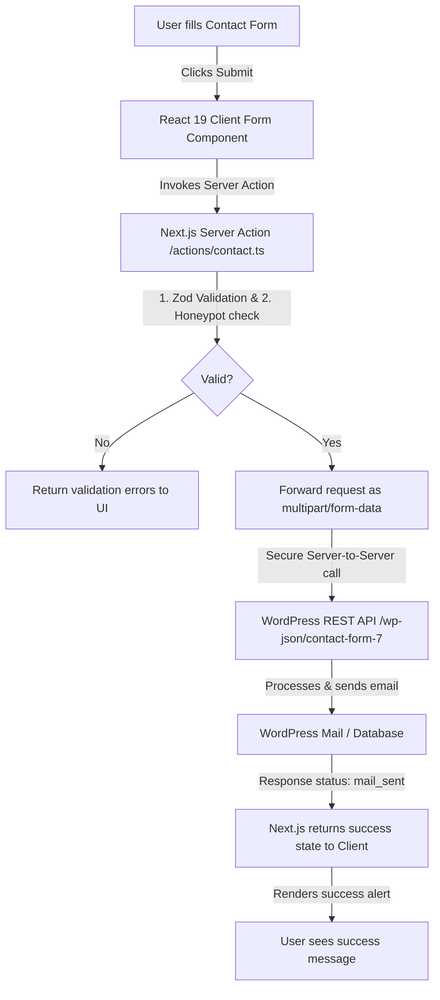

# Connecting Next.js Contact Page to Headless WordPress Backend

This guide explains how to connect a contact form in your headless Next.js frontend to a WordPress backend to store and email form submissions. 

In a headless architecture, sending contact submissions directly from the client browser to the WordPress REST API can lead to **CORS errors**, exposes backend URL details, and makes it harder to add server-side validation or spam checks (like Recaptcha keys). 

To solve this, we use **Next.js Server Actions** as a secure proxy.

---

## 1. Architectural Workflow

The contact form submission follows this workflow:



---

## 2. Choosing an Integration Method

There are two primary methods to connect a contact page to WordPress:

| Method | Complexity | Pros | Cons |
| :--- | :--- | :--- | :--- |
| **Method A: Contact Form 7 REST API (Recommended)** | **Low** | Uses the standard WP REST API, requires no extra WPGraphQL plugins, and works instantly out-of-the-box. | Requires a REST API fetch inside the Server Action instead of a GraphQL query. |
| **Method B: WPGraphQL Contact Form 7** | **Medium** | Keeps all frontend-backend communications strictly in GraphQL using queries/mutations. | Requires installing extra, sometimes unsupported WPGraphQL plugins on WordPress. |

---

## Method A: Contact Form 7 REST API (Recommended)

### Step 1: WordPress Backend Setup

1. **Install Contact Form 7**:
   Go to the WordPress admin panel > **Plugins** > **Add New** and install **Contact Form 7**.
2. **Create a Form**:
   Go to **Contact** > **Add New**. Create a form with the following fields:
   * `your-name` (text, required)
   * `your-email` (email, required)
   * `your-subject` (text, required)
   * `your-message` (textarea, required)
3. **Find the Form ID**:
   When you save the form, copy the **Form ID** from the shortcode:
   ```text
   [contact-form-7 id="123" title="Contact form 1"]
   ```
   In this case, the ID is `123`.

---

### Step 2: Next.js Env Configuration

Add your Form ID to your `.env` file. You already have `Secret` configured as the base URL.

```env
# Existing environment variable
Secret=http://localhost/layale_be

# Add your Contact Form 7 Form ID
WP_CONTACT_FORM_ID=123
```

---

### Step 3: Next.js Server Action (`app/actions/contact.ts`)

This Server Action runs entirely on the server. It performs input schema validation using `zod` and sends a server-to-server request to the WordPress REST API.

Create the file `app/actions/contact.ts` (install Zod first with `npm install zod` if not already installed):

```typescript
'use server';

import { z } from 'zod';

// Define schema for client-side form validation
const contactSchema = z.object({
  name: z.string().min(2, { message: 'Name must be at least 2 characters.' }),
  email: z.string().email({ message: 'Please enter a valid email address.' }),
  subject: z.string().min(3, { message: 'Subject must be at least 3 characters.' }),
  message: z.string().min(10, { message: 'Message must be at least 10 characters.' }),
  honeypot: z.string().optional(), // Invisible spam deterrent
});

export type FormState = {
  success: boolean;
  message: string;
  errors?: {
    name?: string[];
    email?: string[];
    subject?: string[];
    message?: string[];
  };
};

export async function submitContactForm(
  prevState: FormState,
  formData: FormData
): Promise<FormState> {
  // 1. Check for spam bots (Honeypot technique)
  const honeypot = formData.get('honeypot') as string;
  if (honeypot && honeypot.trim() !== '') {
    // Silently ignore or return success to trick spam bots
    return {
      success: true,
      message: 'Thank you for your message!',
    };
  }

  // 2. Extract and validate fields
  const name = formData.get('name') as string;
  const email = formData.get('email') as string;
  const subject = formData.get('subject') as string;
  const message = formData.get('message') as string;

  const validatedFields = contactSchema.safeParse({
    name,
    email,
    subject,
    message,
  });

  if (!validatedFields.success) {
    return {
      success: false,
      message: 'Please resolve the validation errors below.',
      errors: validatedFields.error.flatten().fieldErrors,
    };
  }

  // 3. Prepare payload for Contact Form 7
  // CF7 API expects form-data keys corresponding to the shortcode tags
  const cf7FormData = new FormData();
  cf7FormData.append('your-name', name);
  cf7FormData.append('your-email', email);
  cf7FormData.append('your-subject', subject);
  cf7FormData.append('your-message', message);

  // 4. Resolve endpoints
  const wpBaseUrl = process.env.Secret;
  const formId = process.env.WP_CONTACT_FORM_ID || '123';

  if (!wpBaseUrl) {
    console.error('Error: Secret environment variable is missing.');
    return {
      success: false,
      message: 'Server configuration error. Please try again later.',
    };
  }

  const endpoint = `${wpBaseUrl}/wp-json/contact-form-7/v1/contact-forms/${formId}/feedback`;

  try {
    const response = await fetch(endpoint, {
      method: 'POST',
      body: cf7FormData,
      // Prevents caching for form submissions
      cache: 'no-store',
    });

    if (!response.ok) {
      throw new Error(`WordPress responded with status: ${response.status}`);
    }

    const result = await response.json();

    // CF7 returns 'mail_sent' when successful
    if (result.status === 'mail_sent') {
      return {
        success: true,
        message: result.message || 'Thank you! Your message has been sent successfully.',
      };
    }

    // Handle CF7 validation/spam/failure statuses
    return {
      success: false,
      message: result.message || 'There was an issue submitting your form. Please try again.',
    };
  } catch (error) {
    console.error('Error sending contact submission to WordPress:', error);
    return {
      success: false,
      message: 'Unable to deliver message right now. Please check your connection.',
    };
  }
}
```

---

### Step 4: React 19 Client Component (`components/contact/ContactForm.tsx`)

This component handles form inputs, validation errors, and uses React 19's `useActionState` to hook up the Server Action with a built-in `pending` loading state.

Create the file `components/contact/ContactForm.tsx`:

```tsx
'use client';

import React, { useActionState, useRef, useEffect } from 'react';
import { submitContactForm, FormState } from '@/app/actions/contact';

const initialState: FormState = {
  success: false,
  message: '',
};

export default function ContactForm() {
  // useActionState handles:
  // state - return value of the server action
  // formAction - function tied to form action prop
  // isPending - loading state boolean (replaces useFormStatus in parent context)
  const [state, formAction, isPending] = useActionState(submitContactForm, initialState);
  
  const formRef = useRef<HTMLFormElement>(null);

  // Clear form inputs on successful submission
  useEffect(() => {
    if (state.success && formRef.current) {
      formRef.current.reset();
    }
  }, [state.success]);

  return (
    <form
      ref={formRef}
      action={formAction}
      className="space-y-6 max-w-xl mx-auto p-8 rounded-xl bg-white border border-[#E5E7EB] dark:bg-[#111] dark:border-[#222]"
    >
      {/* 1. Honeypot (Invisible field to prevent Spam bots) */}
      <div className="hidden">
        <label htmlFor="honeypot">Leave this blank</label>
        <input type="text" id="honeypot" name="honeypot" tabIndex={-1} autoComplete="off" />
      </div>

      {/* 2. Global Feedback Message */}
      {state.message && (
        <div
          className={`p-4 rounded-lg text-sm border font-medium ${
            state.success
              ? 'bg-emerald-50 border-emerald-200 text-emerald-800 dark:bg-emerald-950/20 dark:border-emerald-800 dark:text-emerald-400'
              : 'bg-rose-50 border-rose-200 text-rose-800 dark:bg-rose-950/20 dark:border-rose-800 dark:text-rose-400'
          }`}
          role="alert"
        >
          {state.message}
        </div>
      )}

      {/* 3. Name Field */}
      <div>
        <label htmlFor="name" className="block text-sm font-semibold text-gray-700 dark:text-gray-300 mb-2">
          Your Name
        </label>
        <input
          type="text"
          id="name"
          name="name"
          required
          disabled={isPending}
          className="w-full px-4 py-3 rounded-lg border border-gray-300 dark:border-[#222] bg-transparent text-gray-900 dark:text-white focus:outline-none focus:ring-2 focus:ring-[#2C322D] transition disabled:opacity-50"
        />
        {state.errors?.name && (
          <p className="mt-1 text-xs text-rose-600 dark:text-rose-400 font-medium">{state.errors.name[0]}</p>
        )}
      </div>

      {/* 4. Email Field */}
      <div>
        <label htmlFor="email" className="block text-sm font-semibold text-gray-700 dark:text-gray-300 mb-2">
          Email Address
        </label>
        <input
          type="email"
          id="email"
          name="email"
          required
          disabled={isPending}
          className="w-full px-4 py-3 rounded-lg border border-gray-300 dark:border-[#222] bg-transparent text-gray-900 dark:text-white focus:outline-none focus:ring-2 focus:ring-[#2C322D] transition disabled:opacity-50"
        />
        {state.errors?.email && (
          <p className="mt-1 text-xs text-rose-600 dark:text-rose-400 font-medium">{state.errors.email[0]}</p>
        )}
      </div>

      {/* 5. Subject Field */}
      <div>
        <label htmlFor="subject" className="block text-sm font-semibold text-gray-700 dark:text-gray-300 mb-2">
          Subject
        </label>
        <input
          type="text"
          id="subject"
          name="subject"
          required
          disabled={isPending}
          className="w-full px-4 py-3 rounded-lg border border-gray-300 dark:border-[#222] bg-transparent text-gray-900 dark:text-white focus:outline-none focus:ring-2 focus:ring-[#2C322D] transition disabled:opacity-50"
        />
        {state.errors?.subject && (
          <p className="mt-1 text-xs text-rose-600 dark:text-rose-400 font-medium">{state.errors.subject[0]}</p>
        )}
      </div>

      {/* 6. Message Field */}
      <div>
        <label htmlFor="message" className="block text-sm font-semibold text-gray-700 dark:text-gray-300 mb-2">
          Message
        </label>
        <textarea
          id="message"
          name="message"
          rows={5}
          required
          disabled={isPending}
          className="w-full px-4 py-3 rounded-lg border border-gray-300 dark:border-[#222] bg-transparent text-gray-900 dark:text-white focus:outline-none focus:ring-2 focus:ring-[#2C322D] transition disabled:opacity-50 resize-none"
        />
        {state.errors?.message && (
          <p className="mt-1 text-xs text-rose-600 dark:text-rose-400 font-medium">{state.errors.message[0]}</p>
        )}
      </div>

      {/* 7. Submit Button */}
      <button
        type="submit"
        disabled={isPending}
        className="w-full py-4 px-6 rounded-lg bg-[#2C322D] hover:bg-[#3d453e] text-white font-semibold transition shadow-md hover:shadow-lg disabled:opacity-50 disabled:cursor-not-allowed flex items-center justify-center space-x-2"
      >
        {isPending ? (
          <>
            <svg className="animate-spin h-5 w-5 text-white" fill="none" viewBox="0 0 24 24">
              <circle className="opacity-25" cx="12" cy="12" r="10" stroke="currentColor" strokeWidth="4" />
              <path className="opacity-75" fill="currentColor" d="M4 12a8 8 0 018-8V0C5.373 0 0 5.373 0 12h4zm2 5.291A7.962 7.962 0 014 12H0c0 3.042 1.135 5.824 3 7.938l3-2.647z" />
            </svg>
            <span>Sending...</span>
          </>
        ) : (
          <span>Send Message</span>
        )}
      </button>
    </form>
  );
}
```

---

### Step 5: Next.js Contact Page Route (`app/contact/page.tsx`)

This renders the main page layout, leveraging the theme settings fetched dynamically. Create `app/contact/page.tsx`:

```tsx
import React from 'react';
import ContactForm from '@/components/contact/ContactForm';
import { getHeaderAndHomePageData } from '@/lib/wordpress';
import type { Metadata } from 'next';

export const metadata: Metadata = {
  title: 'Contact Us | Layale',
  description: 'Get in touch with our design team for expert assistance.',
};

export default async function ContactPage() {
  const { themeSettings } = await getHeaderAndHomePageData();
  
  const addressText = themeSettings?.footer_contact_content?.footer_contact_address || 'Dubai, U.A.E.';
  const emailText = themeSettings?.footer_contact_content?.footer_contact_email || 'info@layalegroup.com';
  const phoneText = themeSettings?.footer_contact_content?.footer_contact_phone || '+971 58 58 38 722';

  return (
    <main className="w-full py-16 md:py-24 bg-gray-50 dark:bg-black font-['Google_Sans',sans-serif]">
      <div className="w-full px-5 md:px-[30px] xl:px-10 mx-auto max-w-[1200px]">
        {/* Header Block */}
        <div className="text-center max-w-2xl mx-auto mb-16">
          <h1 className="text-4xl md:text-5xl font-bold tracking-tight text-gray-900 dark:text-white mb-4">
            Contact Our Team
          </h1>
          <p className="text-lg text-gray-600 dark:text-gray-400">
            Have questions about our collections, customized orders, or need design inspiration? We're here to help.
          </p>
        </div>

        {/* Form & Info Section */}
        <div className="grid grid-cols-1 lg:grid-cols-12 gap-12 items-start">
          {/* Form */}
          <div className="lg:col-span-7">
            <ContactForm />
          </div>

          {/* Contact Details */}
          <div className="lg:col-span-5 space-y-8 bg-[#2C322D] text-white p-8 md:p-10 rounded-2xl shadow-xl">
            <div>
              <h2 className="text-2xl font-bold mb-6 border-b border-white/20 pb-4">Our Information</h2>
              <p className="text-white/80 leading-relaxed mb-6">
                Feel free to visit us or reach out via email/phone during our operational hours.
              </p>
            </div>

            <div className="space-y-6">
              {/* Address */}
              <div className="flex items-start space-x-4">
                <div className="p-3 bg-white/10 rounded-lg shrink-0">
                  <svg className="w-6 h-6 text-white" fill="none" viewBox="0 0 24 24" stroke="currentColor">
                    <path strokeLinecap="round" strokeLinejoin="round" strokeWidth={2} d="M17.657 16.657L13.414 20.9a1.998 1.998 0 01-2.827 0l-4.244-4.243a8 8 0 1111.314 0z" />
                    <path strokeLinecap="round" strokeLinejoin="round" strokeWidth={2} d="M15 11a3 3 0 11-6 0 3 3 0 016 0z" />
                  </svg>
                </div>
                <div>
                  <h4 className="font-semibold text-sm uppercase tracking-wider text-white/50">Location</h4>
                  <p className="text-white/95 mt-1 text-sm">{addressText}</p>
                </div>
              </div>

              {/* Email */}
              <div className="flex items-start space-x-4">
                <div className="p-3 bg-white/10 rounded-lg shrink-0">
                  <svg className="w-6 h-6 text-white" fill="none" viewBox="0 0 24 24" stroke="currentColor">
                    <path strokeLinecap="round" strokeLinejoin="round" strokeWidth={2} d="M3 8l7.89 5.26a2 2 0 002.22 0L21 8M5 19h14a2 2 0 002-2V7a2 2 0 00-2-2H5a2 2 0 00-2 2v10a2 2 0 002 2z" />
                  </svg>
                </div>
                <div>
                  <h4 className="font-semibold text-sm uppercase tracking-wider text-white/50">Email</h4>
                  <a href={`mailto:${emailText}`} className="text-white/95 hover:underline mt-1 text-sm block">
                    {emailText}
                  </a>
                </div>
              </div>

              {/* Phone */}
              <div className="flex items-start space-x-4">
                <div className="p-3 bg-white/10 rounded-lg shrink-0">
                  <svg className="w-6 h-6 text-white" fill="none" viewBox="0 0 24 24" stroke="currentColor">
                    <path strokeLinecap="round" strokeLinejoin="round" strokeWidth={2} d="M3 5a2 2 0 012-2h3.28a1 1 0 01.94.725l.548 2.2a1 1 0 01-.321.988l-1.305.98a10.582 10.582 0 004.872 4.872l.98-1.305a1 1 0 01.988-.321l2.2.548a1 1 0 01.725.94V19a2 2 0 01-2 2h-1C9.716 21 3 14.284 3 6V5z" />
                  </svg>
                </div>
                <div>
                  <h4 className="font-semibold text-sm uppercase tracking-wider text-white/50">Phone</h4>
                  <a href={`tel:${phoneText}`} className="text-white/95 hover:underline mt-1 text-sm block">
                    {phoneText}
                  </a>
                </div>
              </div>
            </div>
          </div>
        </div>
      </div>
    </main>
  );
}
```

---

## Method B: WPGraphQL Contact Form 7

If you prefer to communicate with WordPress **solely using GraphQL queries & mutations** to match the existing patterns in `lib/wordpress.tsx`, follow this alternative method.

### Step 1: WordPress Backend Setup

1. Make sure you have **Contact Form 7** and **WPGraphQL** plugins active.
2. Install the **WPGraphQL Contact Form 7** extension on your WordPress instance (e.g., [WPGraphQL Contact Form 7 Plugin](https://github.com/axlright/wp-graphql-contact-form-7)). This registers the mutations in the GraphQL schema.
3. Configure your Contact Form in WordPress as usual and get its database ID.

---

### Step 2: Next.js Server Action (`app/actions/contact.ts`)

Instead of sending form-data to the REST API, you write a GraphQL mutation query and POST it to the GraphQL endpoint (`${process.env.Secret}/graphql`):

```typescript
'use server';

import { z } from 'zod';

const contactSchema = z.object({
  name: z.string().min(2),
  email: z.string().email(),
  subject: z.string().min(3),
  message: z.string().min(10),
});

export type FormState = {
  success: boolean;
  message: string;
};

export async function submitGraphQLContactForm(prevState: any, formData: FormData): Promise<FormState> {
  const name = formData.get('name') as string;
  const email = formData.get('email') as string;
  const subject = formData.get('subject') as string;
  const message = formData.get('message') as string;

  const validated = contactSchema.safeParse({ name, email, subject, message });
  if (!validated.success) {
    return { success: false, message: 'Invalid data inputs.' };
  }

  const wpBaseUrl = process.env.Secret;
  if (!wpBaseUrl) {
    return { success: false, message: 'Server configuration error.' };
  }

  const endpoint = wpBaseUrl.endsWith('/graphql') ? wpBaseUrl : `${wpBaseUrl}/graphql`;

  // GraphQL Mutation Schema registered by the WPGraphQL Contact Form 7 plugin
  const mutation = `
    mutation SubmitContactForm($input: SubmitContactFormInput!) {
      submitContactForm(input: $input) {
        success
        message
      }
    }
  `;

  // Map keys to WPGraphQL input tags
  const variables = {
    input: {
      contactFormId: parseInt(process.env.WP_CONTACT_FORM_ID || '123'),
      clientMutationId: 'contact-form-submission',
      fieldValues: [
        { id: 'your-name', value: name },
        { id: 'your-email', value: email },
        { id: 'your-subject', value: subject },
        { id: 'your-message', value: message },
      ]
    }
  };

  try {
    const response = await fetch(endpoint, {
      method: 'POST',
      headers: { 'Content-Type': 'application/json' },
      body: JSON.stringify({ query: mutation, variables }),
      cache: 'no-store',
    });

    const result = await response.json();
    
    if (result.errors) {
      console.error('GraphQL contact submission errors:', result.errors);
      return { success: false, message: 'Form submission failed in WordPress.' };
    }

    const data = result.data?.submitContactForm;
    if (data?.success) {
      return { success: true, message: data.message || 'Message sent!' };
    }

    return { success: false, message: data?.message || 'Error occurred.' };
  } catch (error) {
    console.error('Network error during GraphQL contact submission:', error);
    return { success: false, message: 'Failed to connect. Please try again.' };
  }
}
```

---

## 3. Best Practices & Security

### Honeypot Field
Both Server Action codes above implement a **Honeypot field** (`honeypot`). This is a standard `<input>` hidden from screen users via Tailwind (`hidden`) but accessible to bot parsers. If a bot fills this field, the server action stops execution and returns early without contacting the WordPress server, protecting you from spam.

### Revalidation
If your contact page elements or settings (like address, phone, or email) are updated in WordPress, ensure they are cached/revalidated properly in Next.js. In [layout.tsx](file:///D:/layalee-next/layale_headless/app/layout.tsx), data fetching revalidates in production:
```typescript
next: { revalidate: process.env.NODE_ENV === 'development' ? 0 : 60 }
```
This guarantees any backend changes propagate to the contact page details within 60 seconds.
